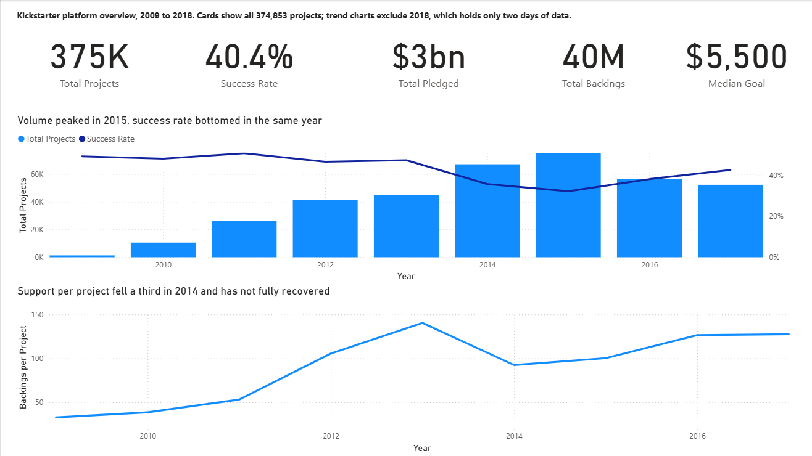
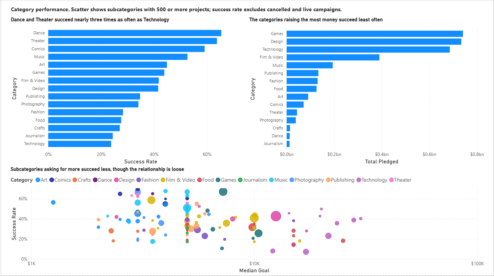
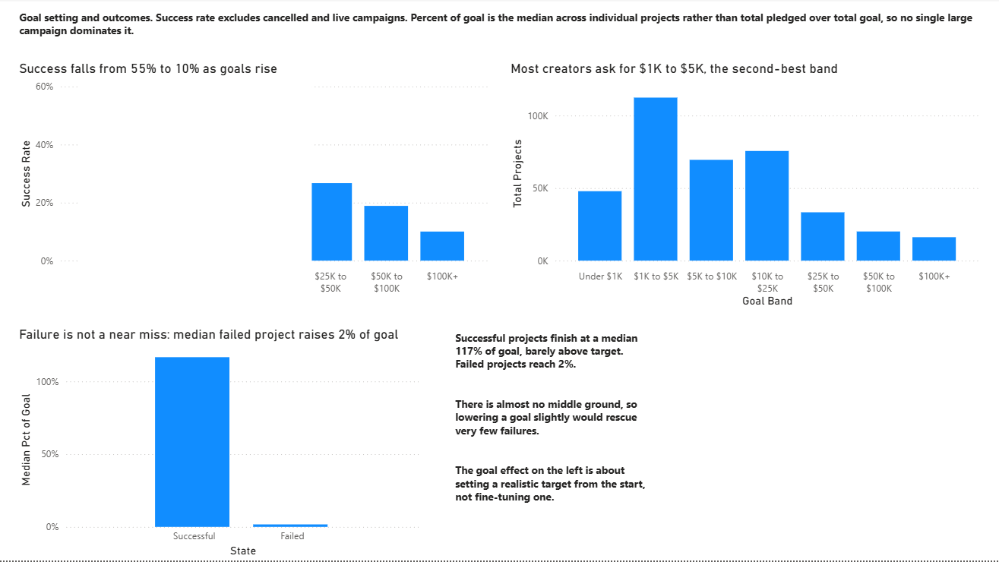
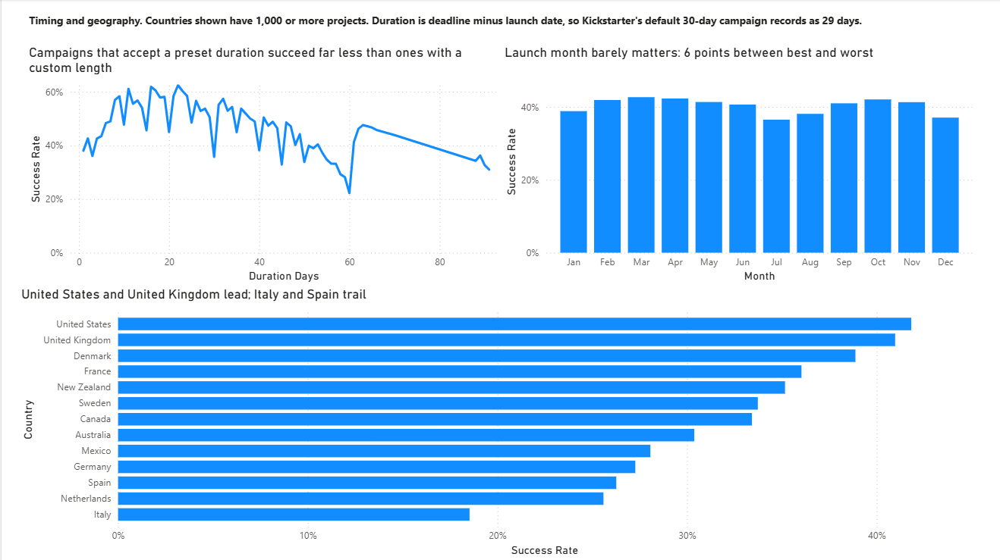

# Kickstarter projects: crowdfunding success analysis

A four-page Power BI report covering 374,853 Kickstarter campaigns launched
between April 2009 and January 2018.

The questions are the ones a creator or a platform analyst would actually ask:
what makes a campaign succeed, whether the platform got harder over time, and
which of the obvious explanations survive contact with the data.

## Headline findings

- Success rate falls from 55% to 10% as goals rise, monotonically across seven bands. [Goal setting](#3-goal-setting)
- Failure is rarely a near miss. Successful campaigns finish at a median 117% of goal, failed ones at 2%. [Goal setting](#3-goal-setting)
- Campaigns that accept a preset duration succeed far less than campaigns one day either side of it. The 30-day default succeeds 35.7% of the time; a custom 31-day campaign succeeds 55.1%. [Timing and geography](#4-timing-and-geography)
- The categories raising the most money succeed least often. Technology is third by revenue and last by success rate. [Category performance](#2-category-performance)
- Success collapsed from 47% to 32% between 2013 and 2015 while volume rose 67%, and support per project fell by a third in a single year. [Platform growth](#1-platform-growth-and-success-rates)
- Category averages conceal more than they show. Inside Games, Tabletop succeeds 67.0% of the time and Mobile Games 10.6%. [Category performance](#2-category-performance)

---

## Business questions

1. How many projects launched over time, and did the platform grow or peak?
2. What share of projects succeed, and has that changed?
3. Which categories succeed most often, and which raise the most money?
4. Which subcategories are outliers within their own category?
5. What does a typical backer pledge, and does it vary by category?
6. Does the size of the goal predict success?
7. How far do successful projects overshoot, and how far do failures fall short?
8. Does campaign duration affect success?
9. Does the month a project launches affect its success?
10. How does success vary by country?

---

## Data

**Source:** [Maven Analytics Data Playground](https://mavenanalytics.io/data-playground), "Kickstarter Projects"
**Licence:** public domain
**Rows:** 374,853 · **Columns:** 11 · **Period:** 21 April 2009 to 2 January 2018

Place `kickstarter_projects.csv` in `data/`. It is not committed to this
repository. The column definitions are in
[`docs/kickstarter_projects_data_dictionary.csv`](./docs/kickstarter_projects_data_dictionary.csv).

The data has no nulls and no duplicate IDs.

### What counts as success

`State` has five values, and the choice of denominator moves the answer by nearly
five percentage points:

| State | Projects | |
|-------|---------:|---|
| Failed | 197,611 | counted |
| Successful | 133,851 | counted |
| Canceled | 38,751 | excluded |
| Live | 2,798 | excluded |
| Suspended | 1,842 | excluded |

Cancelled campaigns were withdrawn by their creator and Live ones had not
finished when the data was captured, so neither has an outcome to count. On that
basis the overall success rate is **40.4%**, against 35.7% if you divide by every
row.

Rather than bury that choice inside one formula, the denominator exists as its own
measure, `Resolved Projects`, so anyone opening the file can see it.

---

## Model

Two tables in a star schema.

`Projects` is the fact table, one row per campaign. `Date Table` is a generated
calendar covering 1 January 2009 to 31 December 2018, joined one-to-many from
`Date Table[Date]` to `Projects[Launch Date]` with single cross-filter direction.

A dedicated date table rather than the launch date column, because a date column
only contains dates on which something happened, so quiet weeks vanish from an
axis rather than showing as zero. Time intelligence functions also require a
contiguous column marked as a date table.

Power BI's automatic date/time hierarchies are turned off. Left on, they generate
a hidden calendar table per date column, which is redundant once a real date
dimension exists.

`Projects` has two dates, `Launch Date` and `Deadline`. Only one relationship to
the calendar can be active, and every question here analyses by launch date, so
that is the active one.

### Columns added in Power Query

Row-level properties belong in the query layer, computed once at refresh, rather
than as measures recalculated for every visual.

| Column | Definition | Purpose |
|---|---|---|
| `Launch Date` | `Date.From([Launched])` | Strips the timestamp so the calendar join matches |
| `Duration Days` | `Duration.Days(Date.From([Deadline]) - Date.From([Launched]))` | Campaign length |
| `Goal Band` | Conditional column, seven bands | Groups goals for comparison |
| `Goal Band Sort` | Conditional column, 1 to 7 | Sort key, since text bands sort alphabetically |

`ID` is stored as text. It is an identifier, never a quantity, and left as a
number Power BI would offer to sum it.

---

## Measures

Eleven measures, defined in [`docs/measures.md`](./docs/measures.md) with the
reasoning behind each one.

---

## Findings

### 1. Platform growth and success rates

**Volume peaked in 2015 and success rate bottomed in the same year.**

Launches grew every year to a peak of 74,919 in 2015, then fell for two
consecutive years. Success rate ran near 50% through 2013, dropped to 32.1% in
2015, and recovered to 42.5% by 2017. The two series turn at the same moment.

The mechanism shows in support per campaign. In 2014 the platform added 22,157
projects, a 49% jump, and total backings actually fell slightly. Backings per
project dropped from 140 to 93 in one year and recovered only as volume came back
down.

| Year | Projects | Backings per project | Success |
|---|---:|---:|---:|
| 2013 | 44,836 | 140.3 | 47.2% |
| 2014 | 66,993 | 92.5 | 35.6% |
| 2015 | 74,919 | 100.3 | 32.1% |
| 2017 | 52,200 | 127.5 | 42.5% |

Crowding is not the only candidate. The category mix shifted over the same period,
with Technology rising from a small share to the largest category by launches in
2015, and Technology is among the hardest categories to fund. Median goals also
rose from $6,000 to $7,000. The data supports crowding as a contributor and cannot
rank the three against each other.

### 2. Category performance

**Success rate and money raised rank categories almost in reverse.**

Dance succeeds 65.4% of the time and has raised $13M in nine years. Technology
succeeds 23.8% of the time and has raised $686M. Games and Design lead on money at
roughly $740M each while sitting mid-table on success.

| Category | Success | Total pledged |
|---|---:|---:|
| Dance | 65.4% | $13M |
| Theater | 63.8% | $44M |
| Comics | 59.1% | $72M |
| Games | 43.9% | $741M |
| Design | 41.6% | $734M |
| Technology | 23.8% | $686M |

A report showing only one of those rankings would mislead whoever read it, which
is why both charts sit side by side.

Category averages also hide most of the variation. Inside Games, Tabletop Games
succeeds 67.0% of the time across 11,744 projects while Mobile Games manages 10.6%.
The spread within Games is 56 percentage points, wider than the spread across all
fifteen categories. Technology's Apps subcategory, at 7.1%, is the worst on the
platform.

The scatter plots all subcategories with 500 or more projects against their median
goal. The downward drift is visible but loose, which is stated as such rather than
dressed up as a clean relationship.

### 3. Goal setting

**Success falls from 55.1% to 10.0% as goals rise, without a single reversal.**

| Goal band | Success rate |
|---|---:|
| Under $1K | 55.1% |
| $1K to $5K | 48.5% |
| $5K to $10K | 40.4% |
| $10K to $25K | 35.0% |
| $25K to $50K | 26.7% |
| $50K to $100K | 18.9% |
| $100K+ | 10.0% |

Every band holds at least 12,000 resolved projects, so the pattern is not thin
data. Most creators cluster in the $1K to $5K band, which is the second best, so
they are broadly well calibrated. Around 66,000 sit in the $10K to $25K band where
success is 35%.

**The obvious conclusion is wrong, though.** Successful projects finish at a median
117% of goal and failed ones at 2%. There is almost no middle ground, so trimming
a goal by 10% would rescue very few failures, because most were never close. The
goal effect is about setting a realistic target at the outset, not fine-tuning
one.

That 117% is worth its own note. Half of all successful campaigns finish under
117% of target, so success is usually narrow. An all-or-nothing funding model
produces exactly that: backers pile into campaigns that look likely to make it and
abandon ones that do not, so momentum compounds in both directions.

### 4. Timing and geography

**Campaigns that accept a preset duration succeed far less than campaigns one day
either side.**

Because `Deadline` carries no time component, a 30-day campaign records here as 29
days, a 45-day as 44, a 60-day as 59. Every trough in the duration chart sits on
one of those presets.

| Recorded | Real length | Projects | Success |
|---:|---|---:|---:|
| 29 | 30 days, the default | 148,364 | 35.7% |
| 30 | 31 days, custom | 11,715 | 55.1% |
| 44 | 45 days | 15,237 | 32.9% |
| 43 | 44 days, custom | 1,374 | 46.4% |
| 59 | 60 days | 27,954 | 22.2% |

Thirty days against thirty-one is a 19-point gap across 160,000 campaigns, and the
pattern repeats at every preset.

Duration is unlikely to be the cause. Projects at preset lengths also carry higher
median goals and a higher share of Technology entries: Technology is 8.9% of
projects at the 30-day default against 2.9% at a custom 15-day length. The pattern
most plausibly reflects how much deliberation went into the campaign as a whole,
with duration acting as a visible marker of it.

The broader trend holds regardless. Campaigns of 15 to 29 days succeed 40.0% of
the time against 27.4% for 45 to 59 days, and no band shows more time helping.

**Launch month barely matters.** The best month, March at 42.7%, beats the worst,
July at 36.5%, by six points. Real at this sample size, but small, and the chart is
titled to say so rather than to imply more.

**Country spread is wider.** The United States leads at 41.8% with the United
Kingdom close behind at 41.0%, then a drop through Canada at 33.4% and Germany at
27.3% to Italy at 18.5%. Only countries with 1,000 or more projects are shown,
since a rate built on 200 campaigns cannot be set beside one built on 261,000.

---

## Assumptions and limitations

**Success rate** counts Successful over Successful plus Failed. Cancelled, Live and
Suspended campaigns are excluded throughout as having no outcome.

**Backings, not backers.** The `Backers` column counts backings per project, so
summing it counts one person once per project they supported. The measure is named
`Total Backings` for that reason. The dataset offers no way to count distinct
people.

**Duration** is deadline minus launch date. Since `Deadline` has no time component
and `Launched` does, every campaign records one day shorter than its nominal
length. This affects the labels on the duration chart, not the comparison between
durations.

**2018 is excluded from trend charts.** The data stops on 2 January 2018, giving
that year 124 projects against 52,200 the year before. Cards show the full period;
trend charts stop at 2017. The page notes this so the totals reconcile.

**Amounts are USD as supplied** and are not adjusted for inflation. A $10,000 goal
in 2009 is treated as equal to $10,000 in 2017, which understates the ambition of
earlier campaigns.

**Four projects have a goal of $0**, and `DIVIDE` returns blank for them rather
than erroring. **Ten projects are marked Failed despite pledging at or above their
goal**, which is left as recorded.

**Correlation, not causation.** The goal-size, duration and category relationships
are all associations. Nothing here is an experiment, and the confounds are named
where they are known.

---

## Files

| Path | Contents |
|---|---|
| `report/kickstarter-projects.pbip` | Power BI project file |
| `report/*.SemanticModel/definition/` | Model as TMDL: tables, relationships, measures as readable DAX |
| `report/*.Report/definition/` | Report as PBIR: one JSON file per page and per visual |
| `docs/measures.md` | Every measure with its reasoning |
| `docs/kickstarter_projects_data_dictionary.csv` | Source column definitions |
| `images/` | Page screenshots |

Saved as `.pbip` rather than `.pbix` so the model and report are readable text
that GitHub can display and diff. A `.pbix` is a binary archive that cannot be
reviewed without downloading it and owning Power BI.
