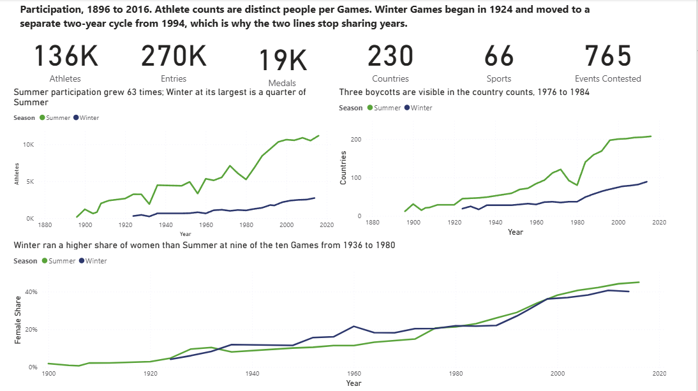
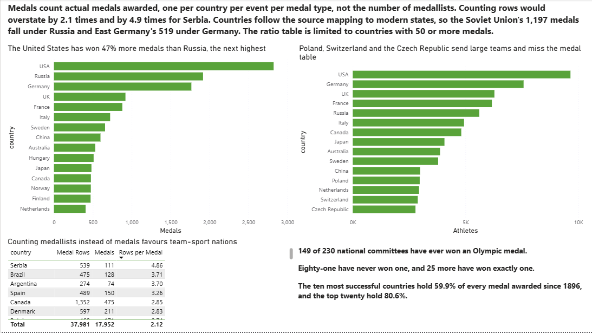
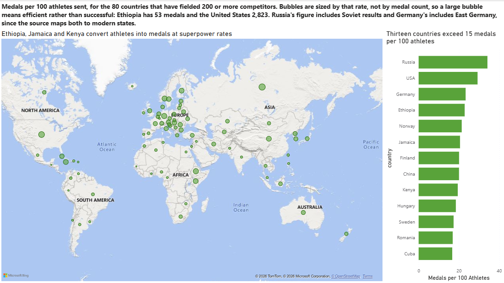
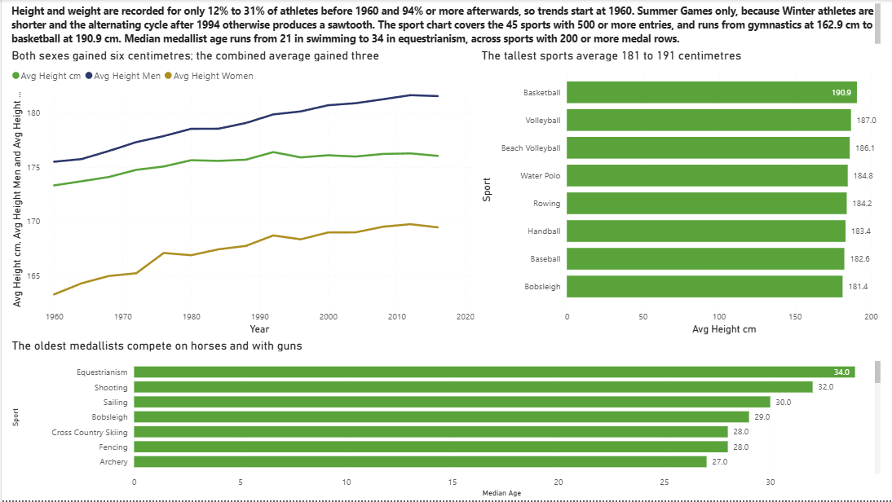
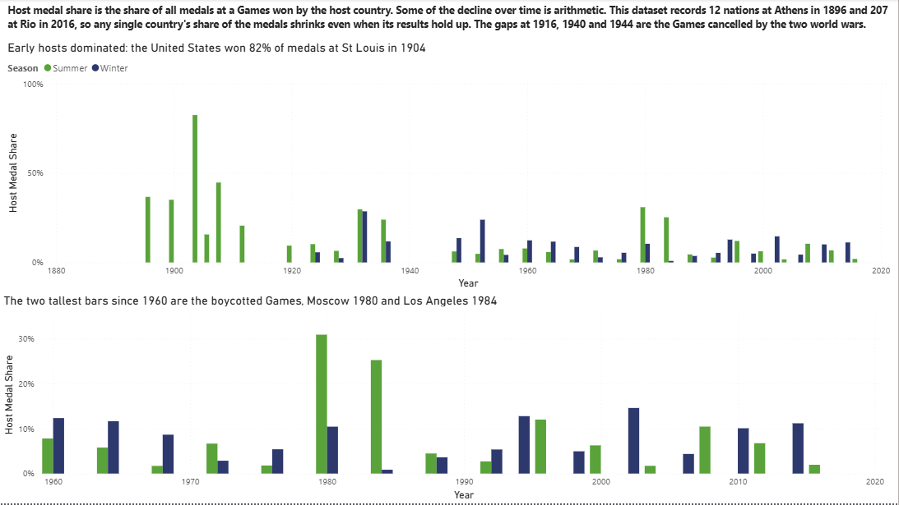
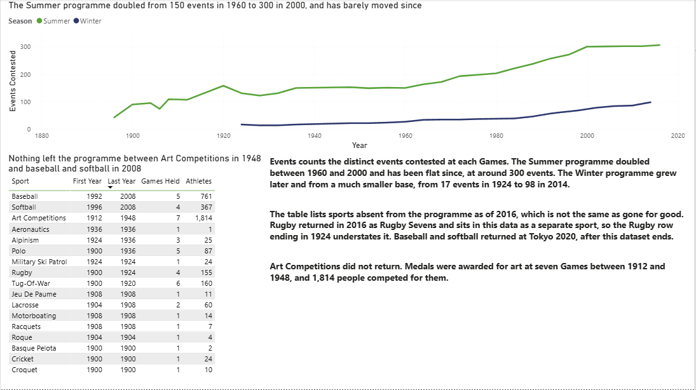

# Olympic athletes: 120 years of the modern Games

A six-page Power BI report covering every recorded athlete entry at the modern
Olympic Games, from Athens 1896 to Rio 2016.

The source is one row per athlete per event, which is the wrong grain for almost
every question anyone would ask of it. Most of the work here is turning that flat
file into a model that counts medals, athletes and events correctly, and then
being careful about which of the resulting patterns are real.

## Headline findings

- Counting medal rows instead of medals overstates the total by 2.1 times, and by 4.9 times for Serbia. [What counts as a medal](#what-counts-as-a-medal)
- 149 of 230 national committees have ever won a medal. Eighty-one have never won one, and the top ten hold 59.9% of every medal awarded since 1896. [Countries](#2-countries)
- Ethiopia has won 53 medals from 232 athletes. The United States has won 2,823 from 9,653. Per athlete sent, the gap between them is far smaller than the medal table suggests. [Efficiency](#3-efficiency)
- Men and women both gained about six centimetres between 1960 and 2016, while the combined average gained under three, because the share of women rose at the same time. [Athletes](#4-athletes)
- The host country won 82.4% of the medals at St Louis in 1904. Since 1960 the median host takes 6.5%. [Host advantage](#5-host-advantage)
- The Summer programme doubled from 150 events in 1960 to 300 in 2000 and has barely moved since. [Programme](#6-programme)
- The Olympics awarded medals for art at seven Games between 1912 and 1948, across 29 events in architecture, literature, music, painting and sculpture. [Programme](#6-programme)

---

## Business questions

1. How has participation changed, and how do the Summer and Winter Games compare?
2. How has the share of female athletes changed over time?
3. Which countries have won the most medals, and how concentrated is the medal table?
4. How many national committees have never won anything?
5. Which countries convert the athletes they send into medals most efficiently?
6. Where does that efficiency sit geographically?
7. How have athlete height and weight changed?
8. Which sports have the oldest medallists and the tallest competitors?
9. How has the event programme changed, and which sports have left it?
10. Do host countries win more at home?

---

## Data

**Source:** [Maven Analytics Data Playground](https://mavenanalytics.io/data-playground),
"120 Years of Olympic History", originally compiled from Sports Reference
**Licence:** public domain
**Rows:** 271,116 · **Columns:** 15 · **Period:** Athens 1896 to Rio 2016

Two files go in `data/`, neither committed here:

| File | Rows | Contents |
|---|---:|---|
| `athlete_events.csv` | 271,116 | One row per athlete per event |
| `country_definitions.csv` | 230 | NOC code to modern country name |

Column definitions are in the two `*_data_dictionary.csv` files in `docs/`.

A third file, [`reference/host_countries.csv`](./reference/host_countries.csv),
is committed. It maps each of the 51 Games to its host city and host NOC and was
built for this project, since the source data records where each Games took place
but not which delegation was the home one.

### What counts as a medal

This is the decision the whole report rests on.

The source has one row per athlete per event, so a team gold produces a row for
every player on the team. Counting rows gives 39,772 medals. Counting actual
medals awarded gives 18,905. The difference is a factor of 2.1, and it is not
spread evenly: Serbia's rows overstate its medals by 4.9 times, because its
history is concentrated in team sports.

A medal is therefore identified by what makes it unique, which is the
combination of Games, event, medal type and country:

```
MedalKey = Games | Event | Medal | NOC
```

`Medals` counts distinct values of that key. `Medal Rows` counts the rows, and
exists so the ratio between them can be shown rather than assumed. The
[Countries](#2-countries) page puts both side by side, because which one you
choose changes the ranking.

---

## Model

Five tables in a star schema. `Entries` is the fact table; the other four are
dimensions, each joined one-to-many with single cross-filter direction.

| Table | Rows | Grain |
|---|---:|---|
| `Entries` | 269,718 | One athlete in one event at one Games |
| `Athlete` | 135,571 | One person |
| `Games` | 51 | One Olympic Games |
| `Event` | 765 | One event, with its sport |
| `Country` | 230 | One national committee |

The flat file was split in Power Query. `athlete_events` loads once as a staging
query with load disabled, and every table above is a `Reference` from it. That
way the source is parsed once and the five tables cannot drift apart.

`Entries` keeps only the identifiers and the row-level facts: `ID`, `NOC`,
`Games`, `Event`, `Medal`, plus `Age`, `Height` and `Weight`. The descriptive
columns move to the dimensions. After they were removed, 1,398 rows became
identical to another row and were dropped, which is how 271,116 becomes 269,718.

`Country` uses the source's own NOC mapping, which resolves historical committees
to modern states. The Soviet Union's 1,197 medals therefore sit under Russia and
East Germany's 519 under Germany. That choice is visible in every country
ranking here and is stated on the pages where it matters.

### Columns added

| Column | Table | Where | Definition |
|---|---|---|---|
| `MedalKey` | `Entries` | Power Query | `Games & "\|" & Event & "\|" & Medal & "\|" & NOC`, null when `Medal` is null |
| `Is Host` | `Entries` | DAX | `IF(Entries[NOC] = RELATED(Games[host_noc]), "Host", "Visitor")` |

`MedalKey` is built in Power Query rather than as a measure, because it is a
property of the row and only needs computing once at refresh. `Is Host` is a
calculated column because it has to exist per row before `Host Medals` can filter
on it.

The host columns reach `Games` by merging `host_countries.csv` into that query,
rather than adding a sixth table. One extra hop in a relationship chain would
have made `RELATED` unusable from `Entries`.

---

## Measures

Twenty-four measures, defined in [`docs/measures.md`](./docs/measures.md) with
the reasoning behind each.

One pattern worth naming here. `Sports` is written as
`COUNTROWS(SUMMARIZE(Entries, Event[Sport]))` rather than
`DISTINCTCOUNT(Event[Sport])`, because `Sport` lives on a dimension. With
single-direction cross-filtering, a measure over a dimension column ignores
filters applied to the fact table, so selecting one Games would return every
sport ever contested. Wrapping it in `SUMMARIZE` forces the filter to travel.
Columns that do sit on `Entries`, such as `NOC` and `Event`, need no such help
and use a plain `DISTINCTCOUNT`.

---

## Findings

### 1. Participation



**Summer participation grew 63 times over 120 years. Winter has never exceeded a
quarter of it.**

Athens 1896 recorded 176 athletes. Rio 2016 recorded 11,179. The Winter Games
started in 1924 with 313 and reached 2,745 at Sochi in 2014, its largest.

Country counts show the boycotts directly. Numbers fall at Montreal 1976, Moscow
1980 and Los Angeles 1984, and recover afterwards, which is worth knowing before
reading anything else on those three Games.

The female share rose from under 5% at the earliest Games to 45% at Rio. Winter
ran ahead of Summer on that measure at nine of the ten Games between 1936 and
1980, then fell behind from 1984 onward.

### 2. Countries



**The medal table is far more concentrated than the entry list.**

| Country | Medals | Athletes |
|---|---:|---:|
| United States | 2,823 | 9,653 |
| Russia | 1,916 | 5,610 |
| Germany | 1,766 | 7,575 |
| United Kingdom | 919 | 6,281 |
| France | 879 | 6,170 |
| Italy | 722 | 4,935 |

The United States has won 47% more medals than Russia. The ten most successful
countries hold 59.9% of every medal awarded since 1896 and the top twenty hold
80.6%. At the other end, 81 of the 230 national committees have never won
anything and 25 more have won exactly one.

Russia's figure includes Soviet results and Germany's includes East Germany,
following the source's mapping to modern states.

The same page shows what happens when you count medallists instead of medals.
The ranking shifts toward countries whose success is concentrated in team sports,
which is the point of keeping both counts visible.

### 3. Efficiency



**Medals per athlete sent tells a different story from the medal table.**

| Country | Medals | Athletes | Per 100 |
|---|---:|---:|---:|
| Russia | 1,916 | 5,610 | 34.2 |
| United States | 2,823 | 9,653 | 29.2 |
| Germany | 1,766 | 7,575 | 23.3 |
| Ethiopia | 53 | 232 | 22.8 |
| Norway | 474 | 2,216 | 21.4 |
| Jamaica | 76 | 370 | 20.5 |
| Kenya | 100 | 515 | 19.4 |

Ethiopia, Jamaica and Kenya sit among the most efficient countries in the data
while holding between 53 and 100 medals each. They send small teams into a narrow
set of events and win a high proportion of what they enter.

The map is limited to the 80 countries that have fielded 200 or more competitors.
A rate built on a delegation of twelve is not comparable to one built on 9,653,
and without that floor the top of the ranking fills with countries that sent one
athlete who happened to medal.

Bubbles are sized by rate rather than by medal count, so a large bubble means
efficient rather than successful.

### 4. Athletes



**Both sexes gained about six centimetres between 1960 and 2016. The combined
average gained under three.**

| Group | 1960 | 2016 | Change |
|---|---:|---:|---:|
| Men | 175.5 cm | 181.5 cm | +6.1 |
| Women | 163.3 cm | 169.4 cm | +6.2 |
| Combined | 173.3 cm | 176.0 cm | +2.7 |

Every subgroup moved more than the total, because the composition changed
underneath it. Women were 11.5% of Summer athletes in 1960 and 45.0% in 2016, and
women are shorter on average, so a growing share of them pulls the combined
figure down while both groups rise. Reading only the combined line would
understate the change by half.

Height and weight are recorded for 12% to 31% of athletes before 1960 and for 94%
or more afterwards, so these trends start at 1960. Summer Games only, because
Winter athletes are shorter and the alternating cycle after 1994 otherwise
produces a sawtooth that has nothing to do with physique.

By sport, average height runs from 162.9 cm in gymnastics to 190.9 cm in
basketball across the 45 sports with 500 or more entries. Median medallist age
runs from 21 in swimming to 34 in equestrianism, across sports with 200 or more
medal rows. The oldest fields are the ones where the equipment does the moving.

### 5. Host advantage



**The host country won 82.4% of the medals at St Louis in 1904. The median host
since 1960 takes 6.5%.**

Most of that fall is arithmetic rather than decline. This dataset records 12
national committees at Athens in 1896 and 207 at Rio in 2016, so any one
country's share of the medals shrinks even when its results hold steady. Host
medal share is a mechanically bounded number and it drops as the field grows.

Two caveats sit on the modern chart. The two tallest bars since 1960 are Moscow
1980 and Los Angeles 1984, and both were boycotted, so a large part of the field
was absent in each case. And the gaps at 1916, 1940 and 1944 are the Games
cancelled by the two world wars.

`Is Host` compares each entry's NOC against the host NOC for that Games, using
the reference file described above.

### 6. Programme



**The Summer programme doubled from 150 events in 1960 to 300 in 2000 and has
barely moved since, finishing at 306 in 2016.**

The Winter programme grew later and from a much smaller base, from 17 events in
1924 to 98 in 2014.

Seventeen sports appear in the data and then stop. Nothing left the programme
between Art Competitions in 1948 and baseball and softball in 2008.

| Sport | First | Last | Games | Athletes |
|---|---:|---:|---:|---:|
| Baseball | 1992 | 2008 | 5 | 761 |
| Softball | 1996 | 2008 | 4 | 367 |
| Art Competitions | 1912 | 1948 | 7 | 1,814 |
| Polo | 1900 | 1936 | 5 | 87 |
| Rugby | 1900 | 1924 | 4 | 155 |
| Tug-Of-War | 1900 | 1920 | 6 | 160 |

Seven of the seventeen appear at exactly one Games, all between 1900 and 1908:
Basque Pelota with two competitors, Roque with four, Racquets with seven, Jeu De
Paume with eleven, Motorboating with fourteen, Croquet with ten and Cricket with
twenty-four. The early Games were improvised in a way that is easy to forget.

Art Competitions is the one that did not come back. Medals were awarded across 29
events in architecture, literature, music, painting and sculpture at seven Games
from 1912 to 1948, and 1,814 people competed for them.

---

## Assumptions and limitations

**Medals are distinct awards, not medallists.** One medal per country per event
per medal type. Where a count of people is meant instead, the measure is named
`Medal Rows` and the pages say which is being shown.

**Countries follow the source's modern mapping.** Soviet, East German,
Czechoslovak and Yugoslav results are folded into successor states. This is the
source's decision, kept for consistency, and it inflates Russia and Germany
relative to a strict by-committee count.

**Athletes are distinct people per filter context, not per Games.** Summing
athlete counts across Games double-counts anyone who competed more than once.

**Height and weight are sparse before 1960**, recorded for 12% to 31% of
athletes, against 94% or more afterwards. Physique trends start at 1960 for that
reason and the page says so.

**Age is missing for some entries** and those rows drop out of the median age
calculations rather than being imputed.

**The data ends at Rio 2016.** Sports listed as having left the programme are
absent as of that date. Rugby returned in 2016 as Rugby Sevens, which the data
holds as a separate sport, and baseball and softball returned at Tokyo 2020,
after this dataset ends.

**Winter and Summer moved to separate cycles in 1994.** Before that they shared
years. Charts that plot both seasons against a year axis will show one line
stopping where the other continues, and this is a scheduling change rather than a
collapse in participation.

**Boycotts are not adjusted for.** Montreal 1976, Moscow 1980 and Los Angeles
1984 each lost a large part of the field. The medal shares for those Games are
left as recorded and flagged where they affect a conclusion.

**Host advantage is an association.** Home crowds, home altitude, host-nation
qualifying places and greater investment in the years before a home Games all
move together, and nothing in this data separates them.

---

## Files

| Path | Contents |
|---|---|
| `report/olympic-athletes.pbip` | Power BI project file |
| `report/*.SemanticModel/definition/` | Model as TMDL: tables, relationships, measures as readable DAX |
| `report/*.Report/definition/` | Report as PBIR: one JSON file per page and per visual |
| `docs/measures.md` | Every measure with its reasoning |
| `docs/*_data_dictionary.csv` | Source column definitions |
| `reference/host_countries.csv` | Games to host city and host NOC, built for this project |
| `images/` | Page screenshots |

Saved as `.pbip` rather than `.pbix` so the model and report are readable text
that GitHub can display and diff. A `.pbix` is a binary archive that cannot be
reviewed without downloading it and owning Power BI.
